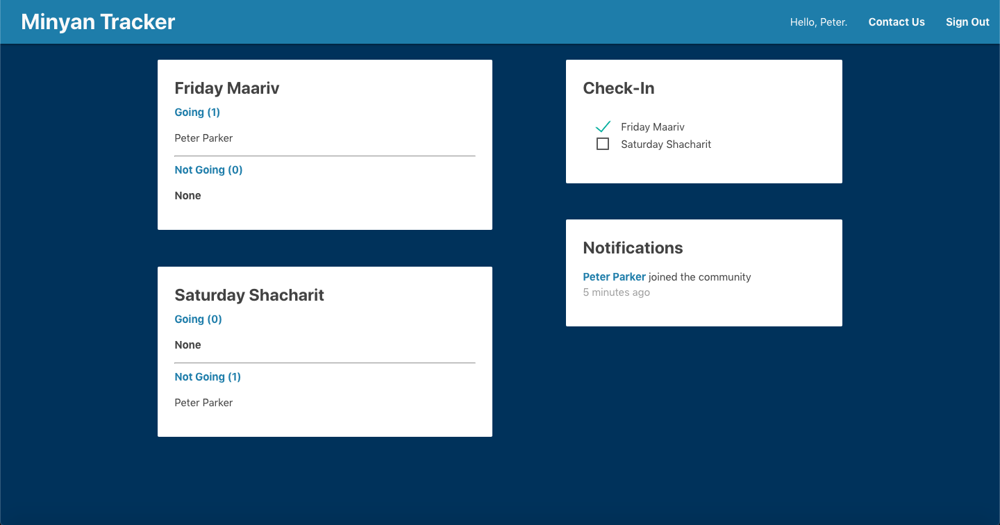

# Minyan Tracker



### Video Presentation:

Coming soon...

### Deployed Web App:

https://minyan-tracker.web.app

### Description:

Responsive web app that allows users to check-in to services at their congregations and share their check-in status with their fellow congregation members in real time.

MVP completed in 4 days for a solo project.

### Tech Stack:

Built using Node.js and Firebase on the backend, and React, Redux, and Materialize.css on the frontend.

### Dev Team:

- Tal Luigi ([LinkedIn](https://www.linkedin.com/in/talluigi) | [GitHub](https://github.com/luigilegion))

### Setting Up Dev Environment:

- Clone the repo and `npm install` the dependencies.
- Create a Firebase project.
- Create a Firestore db using the following schema:

```javascript
SCHEMA PLACEHOLDER
```

- Set the Firestore db rules to the following rules:

```javascript
service cloud.firestore {
  match /databases/{database}/documents {
    match /users/{userId} {
    	allow create
      allow read: if request.auth.uid != null
      allow write: if request.auth.uid == userId
    }
    match /notifications/{notifications} {
      allow read: if request.auth.uid != null
    }
  }
}
```

- Fill in your actual keys in `src/config/`.
- `npm run start` will run in a dev environment.

### Firebase Deployment:

- PLACEHOLDER
